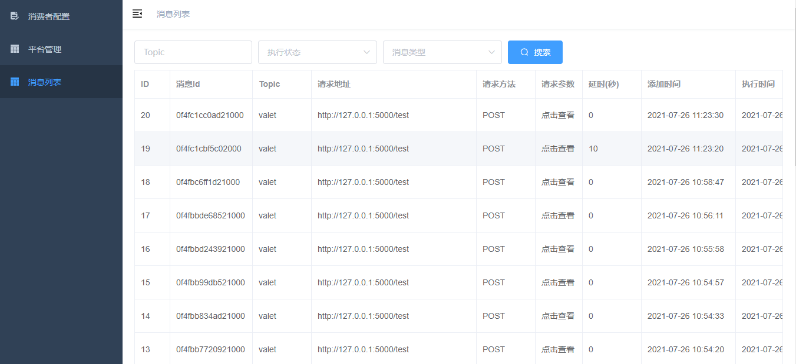

# Nsq proxy
Nsq proxy是Golang开发的NSQ和Worker之间的中间件，根据数据库配置，负责消息转发。Nsq proxy启动后，通過HTTP接受NSQD队列内容，然后通过HTTP协议转发给Worker机执行。

## 解决的问题
* 各Topic执行机器可配
* 各Topic消费速度可配
* 各Worker机协议可配
* HTTP：将消息发送给配好的URL。
* 可视化界面管理
* 队列积压超出阈值报警
* 散乱在各处的消费者集中化管理

## 可视化界面

## 使用
请先部署好NSQLookupd、NSQd、MySQL

> 启动NSQLookupd `nsqlookupd -broadcast-address="0.0.0.0" -http-address="0.0.0.0:4161" -tcp-address="0.0.0.0:4160"`

> 启动NSQD `nsqd -broadcast-address="0.0.0.0" -lookupd-tcp-address="0.0.0.0:4160" -tcp-address="0.0.0.0:4150" -http-address="0.0.0.0:4151"`

> 启动MySQL

## 二次开发

### 前端
使用VUE开发，所有源码均在/web/vue-admin目录中，开发完成后需要编译，编译后的文件存放在/web/public/目录中。使用开源项目statik将静态文件/web/public/变成一个go文件internal/statik/statik.go，这样前端的静态文件也会被我们编译到同一个二进制文件中了。

* 开启VUE开发环境 `npm run dev`
* 浏览器打开 http://0.0.0.0:9528/admin
* 开发前端相关功能
* 编译VUE 预发布环境 `npm run build:stage` 正式环境 `npm run build:prod`
* 前段文件转换为一个go文件,执行 `go generate`
* 编译go服务 `go build`
* 浏览器打开 http://0.0.0.0:19421/admin
